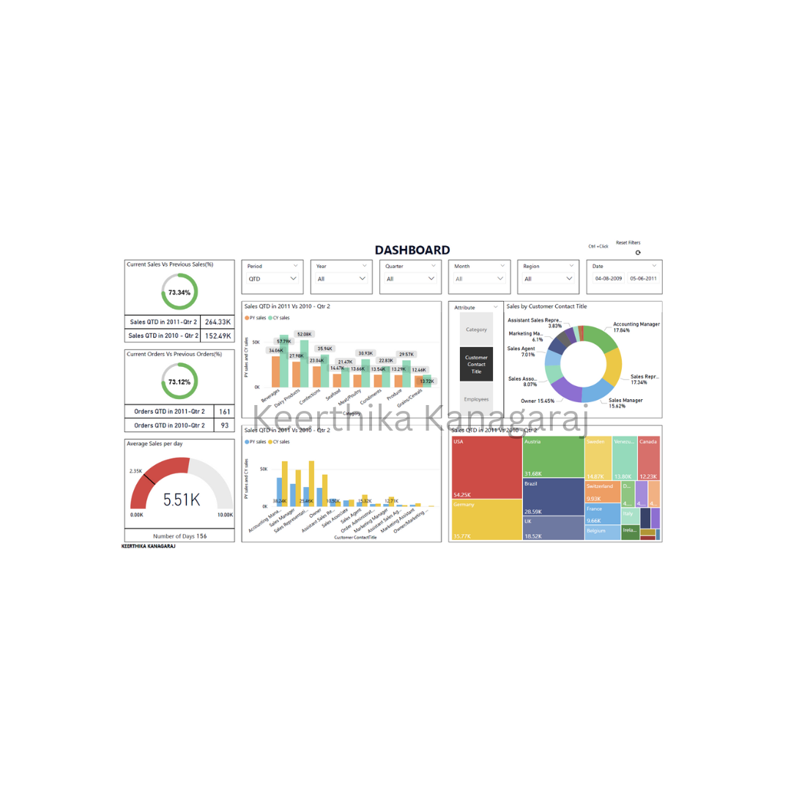
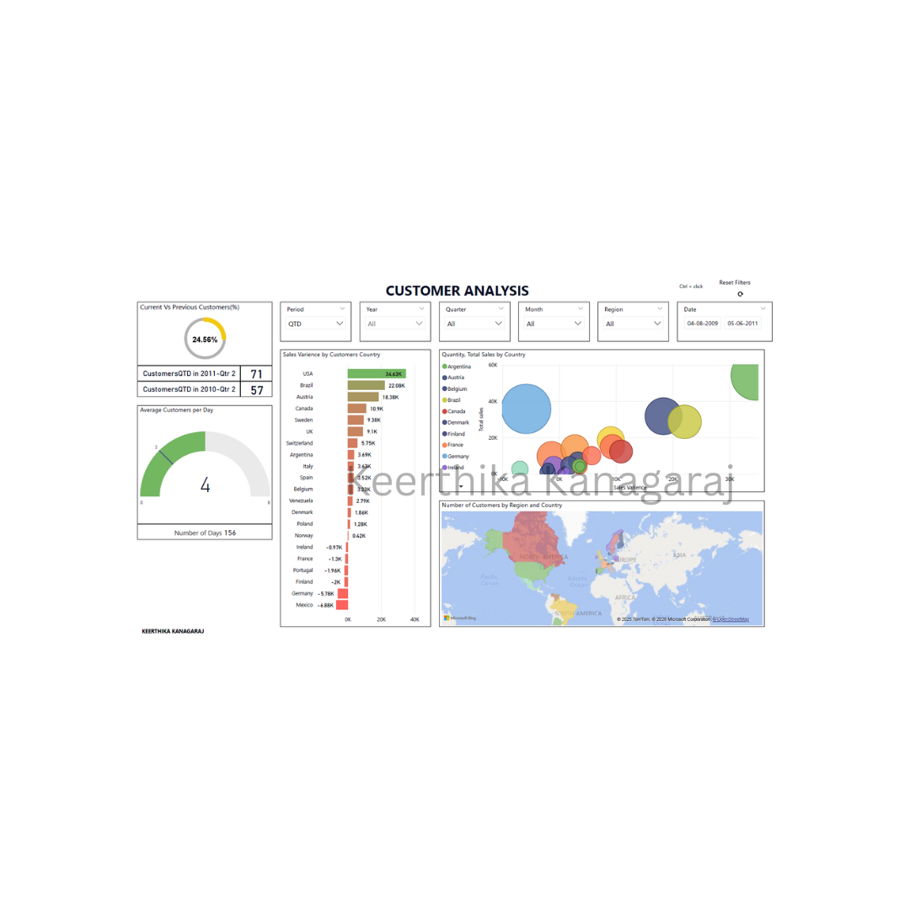
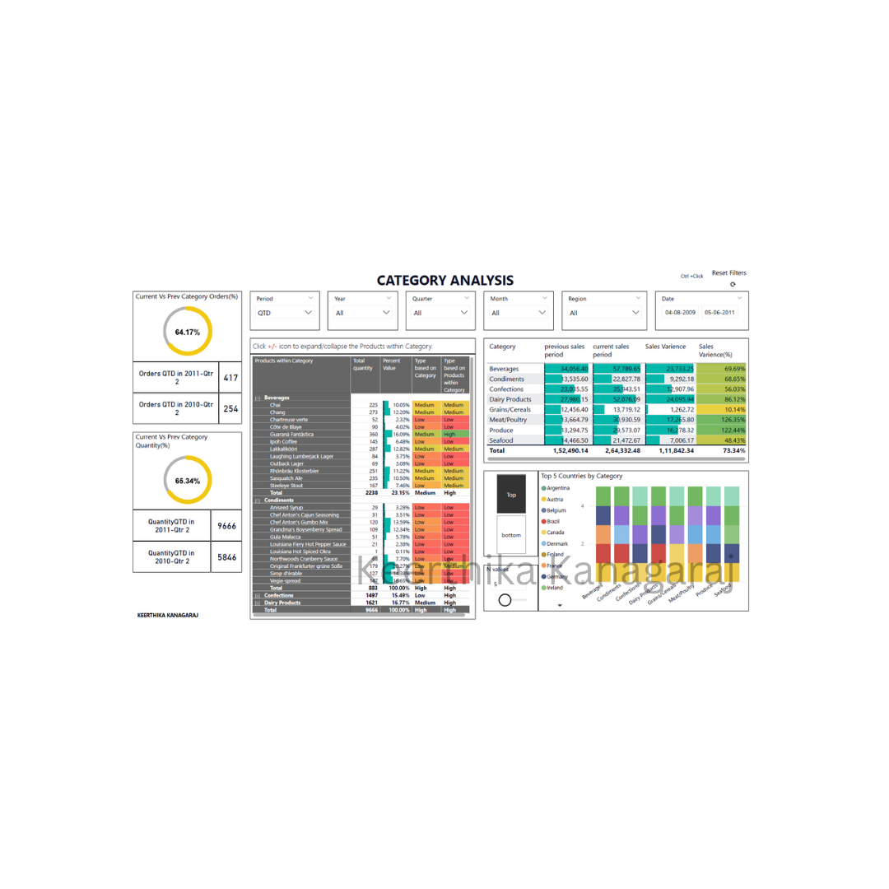
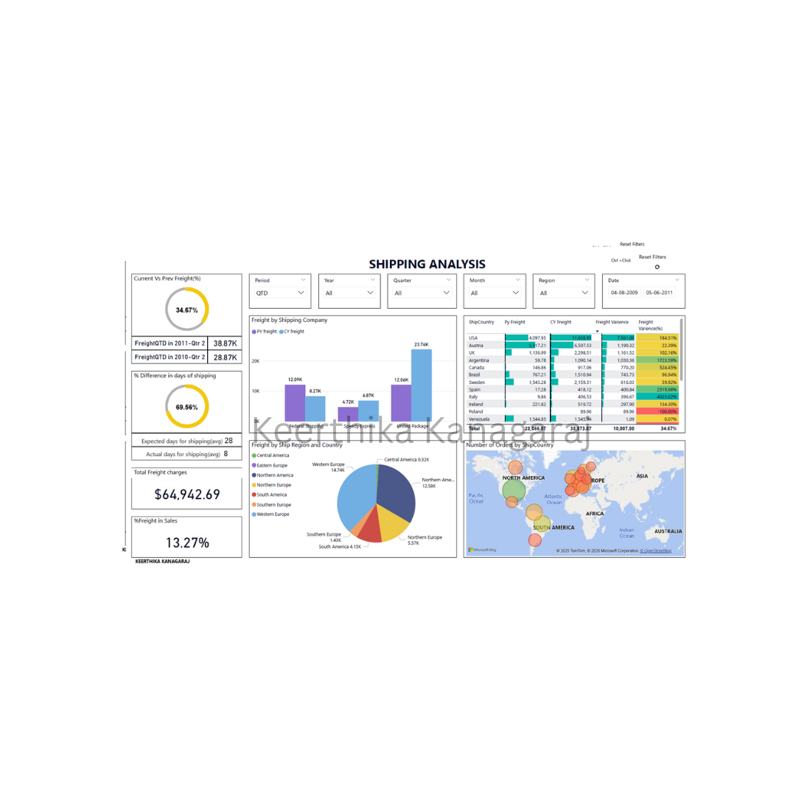

## Key Features of the Sales Dashboard

- **Time-intelligence comparisons (YTD, QTD, MTD):** Across Sales, Orders, Freight, and Customers with % variance KPIs and ytd/qtd/mtd cards to quickly track performance vs previous period.
- **Interactive slicing across business dimensions:** Unified slicers for Period (YTD/QTD/MTD), Year, Quarter, Month, Region, and Date range so users can drill into any time window and geography instantly.
- **Deep drill-down from Category to Product level:** Category Analysis includes an expand/collapse hierarchy (Category → Products) with quantity/percent contribution and category-based classification.
- **Variance analysis with conditional formatting:** Tables for ShipCountry freight variance and Category sales variance use clear variance columns + heat colors to spot outliers and biggest movers fast.
- **Geospatial insights for customers and shipping:** Maps showing orders/customers by country/region plus supporting visuals (treemap/bubble charts) to compare regions, identify high-impact countries, and correlate sales/variance.

## Dashboard Preview

